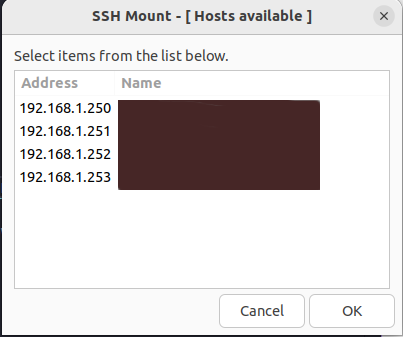

<a name="readme-top"></a>

<br />
<div align="center">
  

  <h3 align="center">SSH Mount</h3>

  <p align="center">
    An awesome script pack to turn ease to use sshfs tool.
  </p>
</div>

<!-- TABLE OF CONTENTS -->
<details>
  <summary>Table of Contents</summary>
  <ol>
    <li><a href="#about-the-project">About The Project</a></li>
    <li><a href="#getting-started">Getting Started</a></li>
    <li><a href="#installation">Installation</a></li>
    <li><a href="#license">License</a></li>
    <li><a href="#contact">Contact</a></li>
  </ol>
</details>

<!-- ABOUT THE PROJECT -->
## About The Project



I implemented this script package to make it easier to mount file systems between my computers on my local network using **sshfs**. It's just an implementation exercise in shell script and **zenity GTK**.

<p align="right">(<a href="#readme-top">back to top</a>)</p>


<!-- GETTING STARTED -->
## Getting Started

This is an example of how you may give instructions on setting up your project locally.
To get a local copy up and running follow these simple example steps.

### Prerequisites

You will need the following tools installed. Find out how to do it on your system operate.
* ssh pack 
  ```ssh
  sudo apt install ssh
  ```
* sshfs
  ```sshfs
    sudo apt install sshfs
  ```
* zenity gtk
  ```zenity
    sudo apt install zenity
  ```
* nmap
  ```nmap
    sudo apt install nmap
  ```

### Installation

_Ho to install._

1. Clone the repo
   ```sh
   git clone https://github.com/salomaodomingos/sshmount.git
   cd sshmount
   ```
3. running sshmount-install.sh
   ```sh
   sudo ./sshmount-install.sh
   ```

<p align="right">(<a href="#readme-top">back to top</a>)</p>

<!-- LICENSE -->
## License

Distributed under the MIT License. See `LICENSE` for more information.

<p align="right">(<a href="#readme-top">back to top</a>)</p>


<!-- CONTACT -->
## Contact

Salomão Domingos - salomaodomingos@gmail.com

Project Link: [https://github.com/salomaodomingos/sshmount](https://github.com/salomaodomingos/sshmount)

<p align="right">(<a href="#readme-top">back to top</a>)</p>